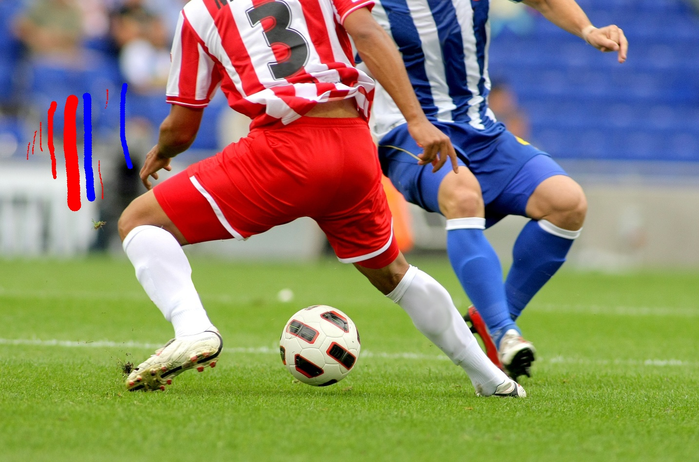

## 2️⃣ 페인팅 프로그램 (붓 크기 조절 기능, E01_2)

설명

마우스 드래그로 이미지를 그릴 수 있는 간단한 페인팅 도구이다. 좌/우 버튼으로 색을 선택하고 키보드 `+`/`-`로 브러시 크기를 조절한다.

주요 사용 함수 및 처리 흐름

- `cv.setMouseCallback(window, callback)` — 마우스 이벤트 등록
- 마우스 이벤트 핸들러에서 `cv.EVENT_LBUTTONDOWN/UP`, `cv.EVENT_RBUTTONDOWN/UP`, `cv.EVENT_MOUSEMOVE` 처리
- `cv.circle(img, (x,y), radius, color, -1)` — 현재 브러시 크기로 원을 채워 그림
- `cv.waitKey(1)` 루프에서 키 처리: `+`/`=` → 크기 증가, `-` → 크기 감소, `q` → 종료

주의: 브러시 크기는 1~15 범위로 제한되어 있다.

실행

```powershell
cd Chapter_01
env\Scripts\python.exe E01_2.py
```
결과



---


