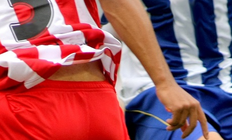

## 3️⃣ 마우스 영역 선택 및 ROI 추출 (E01_3)

설명

사용자가 마우스로 이미지에서 사각형 영역을 드래그하면 그 영역을 ROI로 추출하여 별도 창에 표시하고, 필요시 파일로 저장할 수 있다.

주요 사용 함수 및 처리 흐름

- `cv.setMouseCallback(window, callback)` — 드래그 시작점/이동/종료 이벤트 처리
- 드래그 중에는 `cv.rectangle()`로 현재 선택 영역을 시각화
- ROI 추출: NumPy 슬라이싱 `roi = img[y1:y2, x1:x2].copy()`
- `cv.imshow("ROI", roi)`로 별도 창에 표시
- 키 처리: `r` → 리셋, `s` → 파일 저장, `q` → 종료

실행

```powershell
cd Chapter_01
env\Scripts\python.exe E01_3.py
```
결과



---

## 공통 요구사항 및 환경

- Python 3.8 이상
- OpenCV 설치: `pip install opencv-python`
- NumPy 설치: `pip install numpy`
- 예제 이미지 `soccer.jpg` 및 각 미리보기 이미지는 `Chapter_01` 폴더에 위치함

필요하면 README에 실행 스크린샷을 더 추가하거나, 각 스크립트의 주요 코드 스니펫(핵심 콜백 함수 등)을 포함해 더 상세히 문서화해 드리겠습니다.


